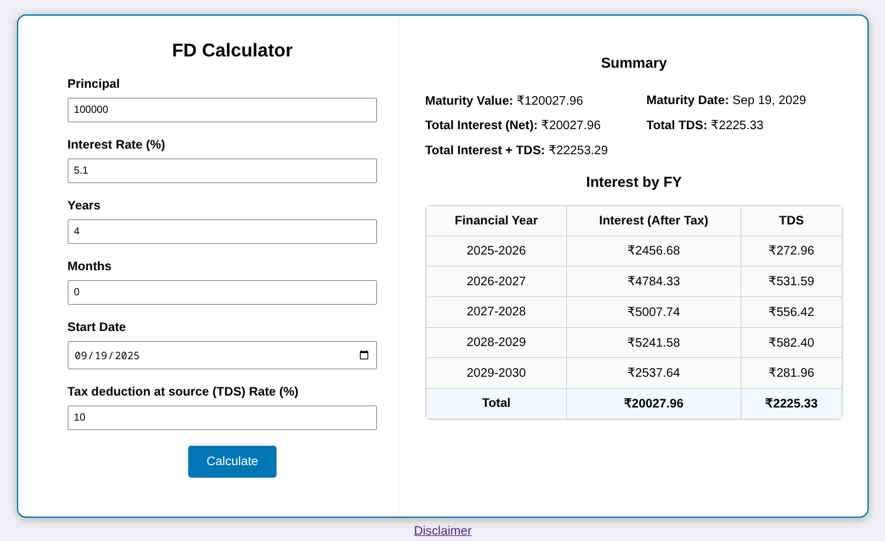

# Fixed Deposit Calculator

A web-based application to calculate the interest and maturity amount for a fixed deposit (FD) based on principal, interest rate, start date, and tax rate. The tool provides detailed results including interest accrued by financial year and tax deductions (TDS).

---

## Demo

https://fdcalculator.github.io

---

## Installation

To run the Fixed Deposit Calculator locally:

1. **Clone the Repository**:
  
   git clone https://github.com/vrrv96/FDCalculator.git

   cd fixed-deposit-calculator
   
3. **Open the Application**:

    Open index.html  in your preferred web browser.

---

## License

This project is licensed under the MIT License.

---

## Disclaimer

The Fixed Deposit Calculator is provided for informational and educational purposes only. It is designed to estimate the interest and maturity amount of a fixed deposit based on user-provided inputs such as principal, interest rate, dates, and tax rate. The calculations are based on standard financial formulas and assumptions, but they may not account for all real-world variables, such as changes in interest rates, bank-specific policies, or additional taxes and fees.This tool is not intended to provide financial, investment, or tax advice. Users should consult with a qualified financial advisor or professional before making any financial decisions. The developers and contributors of this tool are not responsible for any errors, inaccuracies, or omissions in the calculations, nor for any financial losses or damages resulting from the use of this tool.Use of the Fixed Deposit Calculator is at your own risk. Always verify results with your financial institution or advisor before taking any actions based on the tool's output.

